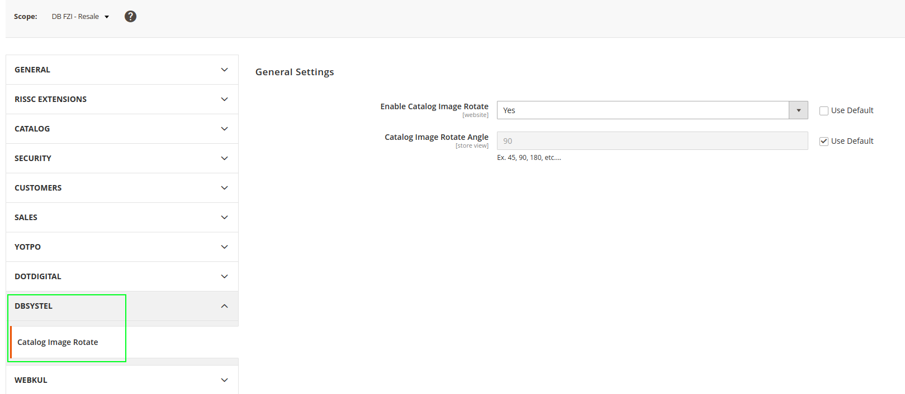

# Comwrap CatalogImageRotate

Comwrap CatalogImageRotate an admin/producer able to rotate the product images at 90 degrees.
Admin users can rotate the product images by 90 degrees in edit mode.
Producers can rotate the product images in the customer area by 90 degrees in edit mode.

## Backend

####Store Configuration
- On the Admin sidebar, go to Stores > Settings > Configuration.
- Complete the default settings
  - In the **Comwrap** section of the left panel, choose **Catalog Image Rotate**.
  - Expand Expansion selector the **General Settings** section.
  - Set **Enable Catalog Image Rotate** to Yes.
  - Add Rotate Angle in **Catalog Image Rotate Angle**.

  

####Catalog Products Edit
- On the Admin sidebar, go to Catalog > Products.
- Add/Edit Product >> Images And Videos >> you will see rotate icon if image uploaded(Please check below screenshot) >> click on rotate icon and save the product.
  
  

